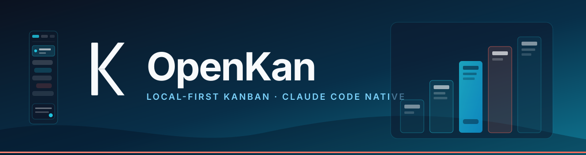

# OpenKan



Local-first project management for people and coding agents.

OpenKan is a five-column MDX kanban with rich task workspaces, project
documentation, MDX previews, contributor attribution, and a native Claude Code
control plane — agents, durable tasks, sessions, chat history, and live
activity all in one management workspace. It runs on `127.0.0.1`, stores project
state under `.ok/`, and does not require a hosted service.

```text
┌───────────────────────────────────────────────────────────────┐
│ Tasks  │ Docs  │ Claude  │                          ⚙ Chat ▌ │
│ ▼ Backlog ▼ To Do ▼ Doing ▼ Review ▼ Done   │   ▌chat▐        │
│   cards, drag, search, filters, archives    │   ▌sidebar▐     │
│                                            │   ┌────────┐    │
│  board + MDX + docs + changelog + …        │   │ model  │    │
│                                            │   │ effort │    │
│                                            │   │ perms  │    │
│                                            │   ├────────┤    │
│                                            │   │  msgs  │    │
│                                            │   ├────────┤    │
│                                            │   │ agents │    │
│                                            │   │ teams  │    │
│                                            │   │ flows  │    │
│                                            │   └────────┘    │
└───────────────────────────────────────────────────────────────┘
```

## Highlights

- **Five-column board** with drag-and-drop, bulk actions, search, filters,
  subtasks, and archives
- **MDX task workspaces** with comments, structured questions, and sandboxed
  TSX previews
- **Project documentation browser** with cross-tab linking
- **Multi-project switching** and live filesystem / SSE / WebSocket updates
- **Native Claude Code control plane** — reads your local `~/.claude/`
  agents, teams, workflows, and model router directly. No external process to
  spawn; no separate database to keep in sync.
- **Chat sidebar (in development)** — drive Claude Code from a right-side rail
  with session/model/effort/permissions selectors and a live subagent +
  workflow activity footer.
- **`.ok/` planning system** — durable tasks, plans, PRDs, and chat sessions
  share the same project directory as the board.
- **`openkan import`** — scan any directory for `[ ]` / `[x]` Markdown
  checkboxes and convert them into tracked kanban tasks (M1 wire).
- **Local-only server** with no authentication, no remote sync, no telemetry.

## Requirements

- Node.js ≥ 22. The npm package ships compiled JavaScript; users do not need
  TypeScript or a build step. Source development uses Node ≥ 22.6 for type stripping.
- `git` for source-tree features
- An optional Claude Code install at `~/.claude/` is required for the Claude
  control plane; the rest of OpenKan runs without it

## Install

```sh
npm install -g @drb0rk/openkan
cd /path/to/project
openkan init
openkan start
```

Or run without a global install: `npx --package @drb0rk/openkan openkan --help`.
The public package is scoped because npm reserves the unscoped `openkan` name;
the installed commands remain `openkan` and `ok`.
Install the bundled command-first agent skill explicitly (no install-time changes
to your agent configuration):

```sh
openkan skill install --agent all       # Claude Code and Codex
# --agent claude or --agent codex; --force updates an existing install
```

### Tasks, goals, and progress from the CLI

No server or HTTP requests are needed for planning:

```sh
openkan task add "Verify release" --owner codex --priority p1
openkan task list --json
openkan task claim TASK_ID --owner codex
openkan task complete TASK_ID --owner codex --evidence "Tests passed"
openkan prd add "Release" --vision "Easy installation" --goals "Ship package|Verify install"
openkan goal list --json
openkan goal update PRD_ID g1 --status met
openkan progress --json
openkan doctor
```

Use IDs printed by creation commands in place of `TASK_ID` and `PRD_ID`.
`openkan plan` manages phases and linked tasks; `ok` is the planning-only alias.
Commands use the nearest existing `.ok/` workspace when invoked in a subdirectory.
For visual board cards and collaboration use `openkan board list|add|show|move|comment`
with the local server running. `openkan project list|use` selects its workspace.
`openkan agent capabilities` describes advanced commands and the API fallback.

### Alternative source installer

OpenKan ships an atomic installer that puts binaries under
`${XDG_DATA_HOME:-~/.local/share}/openkan` and a `openkan` symlink in
`~/.local/bin`:

```sh
curl -fsSL https://raw.githubusercontent.com/PolderLabsVOF/openkan/main/install.sh | bash
```

Pin the install location or target directory:

```sh
curl -fsSL https://raw.githubusercontent.com/PolderLabsVOF/openkan/main/install.sh \
  | OPENKAN_HOME=/opt/openkan OPENKAN_BIN_DIR="$HOME/bin" bash
```

Set `OPENKAN_SKIP_AGENT_SKILLS=1` only when you do not want the installer to
manage the global OpenKan agent skill.

If `~/.local/bin` is not already on `PATH`, add it to your shell profile:

```sh
export PATH="$HOME/.local/bin:$PATH"
```

## Start a project

```sh
cd /path/to/project
openkan init
openkan start
openkan open
```

The dashboard is available at:

```text
http://127.0.0.1:7777/
```

Useful commands:

```sh
openkan status
openkan logs --follow
openkan config list
openkan config set port 7788
openkan import --path notes.md         # scan a file for checkboxes
openkan import --include "**/*.md"     # or a glob
openkan stop
```

Use `openkan --help` for the full CLI.

## Claude Code control plane

OpenKan reads your local Claude Code install directly — there is no separate
control daemon to run.

- Agents, skills, slash commands, hooks, teams, and workflows are read from
  `~/.claude/` by `kanban/claude-state.ts`.
- The model router (`~/.claude/model-router.json`) drives the chat sidebar's
  model selector and the activity feed.
- A WebSocket bridge at `ws://127.0.0.1:7777/api/claude/ws` and an SSE stream
  at `/api/claude/events` push live updates without polling.
- The browser surfaces this as the **Claude** top-level tab and as the
  activity footer inside the **Chat** sidebar.

If you start OpenKan without a Claude Code install, the rest of the board
still works — only the Claude tab and chat sidebar are disabled.

## `.ok/` data layer

OpenKan creates this structure inside each managed project. Two settings
files coexist on purpose: `.ok/openkan.json` is OpenKan's own runtime config;
`.ok/config.json` is the planning-system store (`ok.config.v1`).

```text
.ok/
├── openkan.json          # port, host, theme (OpenKan settings)
├── board.json            # canonical board state
├── board.mdx             # rendered board view
├── config.json           # ok.config.v1 planning store
├── tasks/                # kanban task mirrors (<id>.json)
├── sessions/             # session transcripts
├── chat/                 # chat sidebar transcripts (gitignored)
├── archive/              # archived tasks
├── changelog.jsonl       # append-only event log
└── plans/                # planning system: PRDs, plans, schedules
```

Keep `.ok/tasks/` and `.ok/plans/` in version control when you want a
durable work record. Treat `.ok/sessions/` and `.ok/chat/` as sensitive and
normally gitignore them.

## Planning CLI

The `ok` CLI manages the planning layer — PRD, plans, durable tasks, and
chat sessions — independently of the OpenKan server:

```sh
ok init
ok task add "Wire .ok/ to the OpenKan engine" --owner alice --priority p1
ok task claim tsk-AbCdEfGh --owner alice
ok task complete tsk-AbCdEfGh --owner alice --evidence "kanban/board.ts:200-260"
ok plan add "v0.4 — chat sidebar"
ok index
```

See [`docs/OK-PLANNING.md`](./docs/OK-PLANNING.md) for the full surface and
[`docs/CLAUDE-NATIVE.md`](./docs/CLAUDE-NATIVE.md) for how the planning
system stays in sync with Claude Code sessions and hooks.

## API surface

OpenKan exposes a small loopback API consumed by the dashboard:

```text
GET    /api/board                  board snapshot
GET    /api/tasks                  paged task list
POST   /api/tasks                  create
PATCH  /api/tasks/<id>             move / edit
POST   /api/import                 M1 checkbox scan → tasks
GET    /api/claude/snapshot        Claude Code reader snapshot
GET    /api/claude/ws              WebSocket live updates
GET    /api/claude/events          SSE live updates
POST   /api/chat/send              chat sidebar: send a turn
GET    /api/chat/sessions          list sessions + archived
GET    /api/chat/sessions/<sid>    full transcript
POST   /api/chat/sessions/<sid>/abort   kill running subprocess
```

All routes are loopback-only. See
[`docs/CLAUDE-NATIVE.md`](./docs/CLAUDE-NATIVE.md) for the Claude control
plane contract.

## Security

- The server binds to `127.0.0.1` by default.
- There is no authentication; do not expose the port to a network.
- Session and chat files can contain paths, prompts, and command output.
- TSX previews run in a sandboxed iframe without same-origin access.
- All Claude control-plane endpoints are loopback-only.

## Development

```sh
git clone https://github.com/PolderLabsVOF/openkan.git
cd openkan
npm install
npm test
npm run typecheck
npm run check
npm run e2e
```

Run directly from the checkout:

```sh
npm run openkan -- init
npm run openkan -- start
```

Repository layout:

```text
bin/                 CLI entrypoints (openkan, ok, ok-install)
commands/            Agent command prompts
kanban/              Board, persistence, server, API, Claude readers
ok/                  Planning system storage + command library
skills/openkan/      Portable agent guidance and templates
web/                 Browser application (vanilla JS/CSS)
tests/               Unit, integration, installer, contract, e2e
install.sh           Atomic dedicated-location installer
docs/                User guides (OK-PLANNING, CLAUDE-NATIVE, HOOKS)
```

## Contributing

See [`CONTRIBUTING.md`](./CONTRIBUTING.md).

## License

MIT — see [`LICENSE`](./LICENSE).
