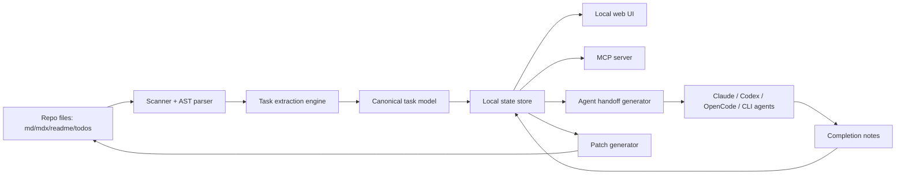
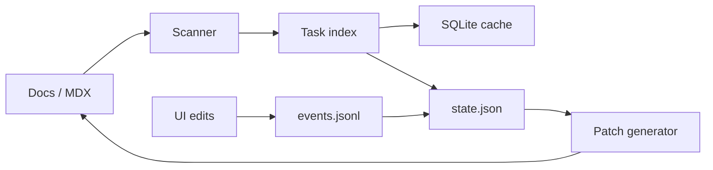
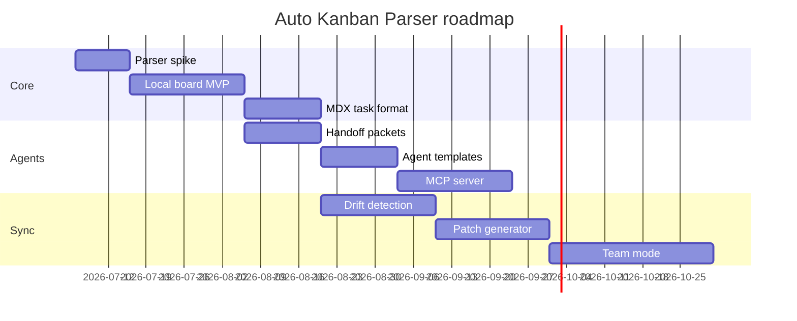

# Auto / Smart Kanban Parser - Technical Plan

A lightweight local-first developer workflow tool that scans a codebase and its documentation, extracts project tasks from Markdown and MDX, renders a live Kanban board, and creates structured handoff packets for local coding agents such as Claude Code, Codex, OpenCode, and generic CLI agents.

The main idea is simple:

> The repo already contains the truth: docs, plans, TODOs, README files, agent notes, MDX pages, and implementation checklists. The tool should turn that truth into a live project cockpit without forcing teams into Jira, Linear, Notion, or a custom cloud platform.

The tool should be easy enough for a team to add with one command, safe enough to run locally inside company repositories, and structured enough that both humans and AI agents can use the same tasks, context, and acceptance criteria.

---

## 1. Executive summary

### Product in one sentence

Auto Kanban Parser is a local-first project cockpit that parses `.md`, `.mdx`, docs, TODO markers, and agent notes into a live Kanban board and structured handoff workflow for humans and coding agents.

### Core promise

A developer runs:

```bash
npx auto-kanban init
npx auto-kanban dev
```

Then the repo gets:

```txt
http://localhost:3987
```

That page shows:

- Kanban board generated from project docs.
- Cards linked back to source files and headings.
- Task detail pages with acceptance criteria and related files.
- Agent handoff packets for Claude, Codex, OpenCode, or custom agents.
- Change log of human and agent progress.
- Drift warnings when docs and task state stop matching.
- Optional local MCP server so agent tools can query and update project state.

### Product philosophy

- **Local-first by default.** No mandatory cloud and no repo upload.
- **MDX-first documentation.** MDX becomes a richer task/documentation format, not only static text.
- **Docs remain understandable without the tool.** Everything should still be readable in GitHub or any editor.
- **AI agents are collaborators, not owners.** Agents can propose updates, but human review is the default.
- **No heavy PM platform clone.** The product is a bridge between repo context, docs, and execution.
- **Safe synchronization.** Avoid silently rewriting docs; prefer patches, review flows, and append-only events.

---

## 2. Why this is worth building

Modern teams using AI coding agents face a new coordination problem:

1. Planning happens in docs, chats, GitHub issues, Linear/Jira, Notion, or MDX pages.
2. Implementation happens in branches, IDEs, terminals, and agent sessions.
3. Agent context often disappears after each run.
4. Handoff notes are inconsistent and easy to lose.
5. Developers repeat context to Claude, Codex, OpenCode, and other tools.
6. The repo gets updated, but docs and tasks drift.

The product solves this by turning repository documentation into a durable, structured task layer.

### The gap

Most project tools are either:

- **Too manual:** Jira, Linear, Trello, Notion. Powerful, but disconnected from actual repo context unless teams keep them updated.
- **Too chat-based:** AI chats and coding agents can help, but context is ephemeral and not always visible to the team.
- **Too code-only:** TODO comments and GitHub issues do not provide a full project view, design rationale, or handoff context.
- **Too cloud-heavy:** Some teams cannot or do not want to upload internal code/docs to a third-party planning platform.

### The opportunity

Create a repo-native layer that:

- Reads docs without requiring a new workflow first.
- Makes current project state visible.
- Gives agents structured tasks.
- Gives humans a low-friction Kanban interface.
- Creates clean handoff and completion records.
- Can later sync to GitHub Issues, Linear, Jira, Slack, Notion, or other systems.

---

## 3. Feasibility verdict

### Technical feasibility: high

The first useful version is very feasible because it does not require advanced AI. The MVP can be built with deterministic parsing and a local web UI:

- Parse Markdown and MDX ASTs.
- Extract headings, checkboxes, frontmatter, and task tags.
- Generate stable task IDs.
- Persist state in a sidecar JSON file or SQLite database.
- Host a local React board.
- Generate Markdown handoff packets for agents.

This is enough to provide value before adding LLM summarization.

### Hardest parts

The hard parts are not the parser or UI. They are:

1. **Source-of-truth design:** deciding when docs, state, or UI edits win.
2. **Task identity stability:** avoiding duplicate cards when text changes.
3. **Conflict handling:** humans and agents may update the same task differently.
4. **Trust and safety:** agents should not rewrite planning docs without review.
5. **Workflow adoption:** the tool must fit existing teams without forcing process change.
6. **MDX safety:** parse MDX statically; never execute untrusted MDX code during indexing.

### Best initial strategy

Build the first version as a local read-only scanner plus editable sidecar state.

Do not start with full auto-sync back into docs. Start with:

- Parse docs into cards.
- Let users move cards in the UI.
- Store transitions in `.kanban/state.json` or `.kanban/events.jsonl`.
- Show source links.
- Generate patches when users want to update docs.

This keeps the tool useful while avoiding destructive sync behavior.

---

## 4. Core user flows

### Flow 1: First install in an existing repo

```bash
cd my-project
npx auto-kanban init
npx auto-kanban scan
npx auto-kanban dev
```

Expected result:

1. Tool creates `.kanban/config.mdx` or `.kanban/config.json`.
2. Tool scans docs and task-like content.
3. Tool shows a local board at `localhost`.
4. User reviews extracted tasks.
5. User marks false positives as ignored.
6. Tool saves review state locally.

### Flow 2: Daily developer workflow

```bash
npx auto-kanban dev
```

Developer opens the local board and sees:

- Todo
- In Progress
- Blocked
- Review
- Done

Each card shows:

- Title
- Source doc
- Confidence
- Priority
- Tags
- Owner or agent
- Related files
- Last update
- Handoff status

The developer selects a task and either works on it manually or creates an agent handoff packet.

### Flow 3: Agent handoff

```bash
npx auto-kanban handoff TASK-123 --agent claude
```

Tool creates:

```txt
.kanban/handoffs/TASK-123/
  task.mdx
  context.mdx
  acceptance.mdx
  related-files.mdx
  constraints.mdx
  done-template.mdx
```

The UI also provides copy-ready prompts:

```md
Implement TASK-123 using the handoff packet in .kanban/handoffs/TASK-123.
Follow constraints.mdx and update done-template.mdx when complete.
Do not change unrelated files.
Run the listed checks before marking complete.
```

### Flow 4: Agent completion

Agent writes a completion file:

```txt
.kanban/handoffs/TASK-123/done.mdx
```

Then user or tool runs:

```bash
npx auto-kanban complete TASK-123 --from .kanban/handoffs/TASK-123/done.mdx
```

Tool records:

- Summary
- Changed files
- Tests run
- Known risks
- Suggested follow-up tasks
- Status transition
- Commit/branch/PR link if available

### Flow 5: Team handoff

A team commits `.kanban/events.jsonl`, `.kanban/state.json`, or generated `handoff.mdx` files.

Another team member runs:

```bash
git pull
npx auto-kanban dev
```

They see the current board and the latest handoff history.

---

## 5. Recommended architecture



### Components

| Component | Responsibility | MVP complexity |
|---|---|---:|
| CLI | init, scan, dev, handoff, sync | Low |
| File scanner | find docs and task-like files | Low |
| Markdown parser | parse headings, checkboxes, links | Medium |
| MDX parser | parse MDX safely without executing JS | Medium |
| Task extraction engine | convert AST nodes into Task records | Medium |
| Task identity engine | stable IDs and duplicate detection | High |
| State store | local sidecar state and event log | Medium |
| Web UI | board, task detail, filters, handoff | Medium |
| Agent adapters | generate prompts and handoff packets | Medium |
| MCP server | expose resources, prompts, tools | Medium |
| Sync engine | propose changes back to docs | High |
| Drift detector | detect stale or conflicting docs | High |

---

## 6. File and folder design

Recommended repo structure after init:

```txt
project-root/
  .kanban/
    config.mdx
    state.json
    events.jsonl
    cache/
      index.json
      file-hashes.json
    handoffs/
      TASK-123/
        task.mdx
        context.mdx
        acceptance.mdx
        related-files.mdx
        constraints.mdx
        done-template.mdx
        done.mdx
    reports/
      weekly-summary.mdx
      drift-report.mdx
  docs/
    roadmap.mdx
    architecture.mdx
    sprint-plan.mdx
  AGENTS.md
```

### Why `.kanban/` should exist

The `.kanban/` folder is the tool's working memory.

It should contain machine-readable state and human-readable handoff records. The project can choose whether to commit all of it or only selected files.

Recommended default:

```txt
Commit:
  .kanban/config.mdx
  .kanban/state.json
  .kanban/events.jsonl
  .kanban/handoffs/**/task.mdx
  .kanban/handoffs/**/acceptance.mdx
  .kanban/handoffs/**/done.mdx

Ignore:
  .kanban/cache/
  .kanban/tmp/
  .kanban/local.sqlite
  .kanban/private/
```

---

## 7. MDX-first design

The product should prefer MDX because it gives you normal Markdown readability plus richer visualization and structured components.

### Why MDX is useful here

MDX can represent:

- Human-readable plans.
- Structured metadata through frontmatter.
- Visual task blocks.
- Architecture diagrams.
- Decision logs.
- Embedded board snapshots.
- Agent handoff sections.
- Acceptance criteria.
- Review checklists.

The parser should support plain Markdown and MDX, but MDX should unlock better UI rendering.

### Important safety rule

The parser must **not execute MDX JavaScript** during indexing.

It should parse the file as text and AST, extract supported static patterns, and ignore dynamic runtime behavior.

Safe:

- Frontmatter
- Markdown headings
- Lists
- Task list items
- Code fences
- Links
- Tables
- Supported MDX JSX component names and props, parsed statically

Unsafe for indexing:

- Running imports
- Evaluating expressions
- Executing arbitrary JSX
- Loading remote components

---

## 8. MDX task authoring format

### Option A: simple Markdown task

```mdx
## Implement settings panel

- [ ] Add settings page
- [ ] Persist user preferences
- [ ] Add tests
```

Parser output:

- One parent task from heading.
- Three subtasks from checkbox items.

### Option B: frontmatter task file

```mdx
---
task:
  id: TASK-123
  status: todo
  priority: high
  owner: nizar
  agent: codex
  tags:
    - frontend
    - settings
  source: docs/roadmap.mdx
---

# Implement settings panel

Users need a settings page where they can configure workspace behavior.

## Acceptance criteria

- [ ] User can open settings from sidebar
- [ ] Preferences persist locally
- [ ] Keyboard shortcut still works
- [ ] Tests cover default preferences

## Related files

- `apps/web/src/routes/settings.tsx`
- `packages/config/src/preferences.ts`
```

### Option C: MDX visual task component

This is optional and should be parsed statically.

```mdx
<TaskCard
  id="TASK-123"
  status="todo"
  priority="high"
  owner="nizar"
  agent="claude"
  tags={["frontend", "settings"]}
>
  Implement settings panel with local preference persistence.
</TaskCard>
```

Parser behavior:

- Recognize `TaskCard` component name.
- Extract supported literal props.
- Extract plain text children.
- Ignore dynamic props unless explicitly allowed.

### Option D: MDX board snapshot

```mdx
<KanbanSnapshot
  title="Sprint 1"
  columns={[
    { name: "Todo", taskIds: ["TASK-101", "TASK-102"] },
    { name: "In Progress", taskIds: ["TASK-103"] },
    { name: "Done", taskIds: ["TASK-100"] }
  ]}
/>
```

This is useful for documentation, but the tool should avoid relying on complex JavaScript expressions. A safer approach is to use YAML frontmatter or JSON code fences for board snapshots.

---

## 9. Task extraction strategy

Use layered extraction. Start deterministic, then add intelligence.

### Layer 1: deterministic extraction

Extract from:

- Markdown checkboxes: `- [ ]`, `- [x]`
- Headings under configured sections: `## Tasks`, `## Roadmap`, `## TODO`, `## Sprint`
- Frontmatter task objects
- Code comments: `TODO`, `FIXME`, `HACK`, `BUG`, `NOTE`
- Explicit tags: `@todo`, `@blocked`, `@agent`, `@owner`, `@priority`
- Supported MDX components: `Task`, `TaskCard`, `Kanban`, `Decision`, `Milestone`

Pros:

- Fast
- Cheap
- Predictable
- Easy to test
- Works offline

Cons:

- Misses implicit tasks
- Can produce false positives
- Needs conventions for best results

### Layer 2: heuristics

Infer:

- Status from nearby words: todo, doing, blocked, done, shipped.
- Priority from keywords: urgent, critical, nice-to-have.
- Owner from mentions: `@nizar`, `owner:`, `assigned:`.
- Sprint from headings.
- Related files from inline code paths.
- Agent suitability from task type.
- Confidence score.

Example:

```md
## Sprint 2

Blocked: Settings page cannot ship until config schema is stable.
```

Could become:

```json
{
  "title": "Settings page cannot ship until config schema is stable",
  "status": "blocked",
  "sprint": "Sprint 2",
  "confidence": 0.72
}
```

### Layer 3: optional LLM enrichment

Use LLM only for tasks that benefit from semantic understanding:

- Summarize long planning docs.
- Merge duplicates.
- Convert vague notes into clean card titles.
- Generate acceptance criteria.
- Identify likely blockers.
- Suggest related files.
- Create handoff prompts.

Do not use LLM for baseline parsing. The tool should work without API keys.

---

## 10. Canonical task model

Recommended TypeScript type:

```ts
export type TaskStatus =
  | 'inbox'
  | 'todo'
  | 'in_progress'
  | 'blocked'
  | 'review'
  | 'done'
  | 'ignored';

export type TaskPriority = 'low' | 'medium' | 'high' | 'critical';

export interface KanbanTask {
  id: string;
  title: string;
  description?: string;
  status: TaskStatus;
  priority?: TaskPriority;
  owner?: string;
  agent?: 'claude' | 'codex' | 'opencode' | 'custom';
  tags: string[];
  source: TaskSource;
  subtasks: Subtask[];
  acceptanceCriteria: string[];
  relatedFiles: RelatedFile[];
  links: LinkRef[];
  confidence: number;
  createdAt?: string;
  updatedAt?: string;
  lastSeenAt: string;
  lastSeenHash: string;
  syncPolicy: SyncPolicy;
  provenance: ProvenanceEvent[];
}

export interface TaskSource {
  path: string;
  heading?: string;
  lineStart?: number;
  lineEnd?: number;
  kind: 'frontmatter' | 'checkbox' | 'heading' | 'mdx_component' | 'comment' | 'manual';
}

export interface Subtask {
  id: string;
  title: string;
  done: boolean;
  sourceLine?: number;
}

export interface RelatedFile {
  path: string;
  reason?: string;
  confidence?: number;
}

export interface LinkRef {
  label: string;
  url: string;
  kind?: 'github' | 'linear' | 'jira' | 'figma' | 'docs' | 'other';
}

export interface SyncPolicy {
  mode: 'read_only' | 'sidecar' | 'patch' | 'write_back';
  allowAutoWrite: boolean;
  requireReview: boolean;
}

export interface ProvenanceEvent {
  at: string;
  by: 'human' | 'agent' | 'system';
  actor?: string;
  action: string;
  summary?: string;
  source?: string;
}
```

### Stable task IDs

The ID system must avoid duplicate cards when a task text changes slightly.

Recommended priority:

1. Use explicit `id` from frontmatter or MDX component.
2. If inside `.kanban/handoffs`, use folder name.
3. If checkbox has hidden marker, use marker.
4. If no ID, generate from path + nearest heading + normalized title hash.

Example hidden marker:

```md
- [ ] Implement settings panel <!-- akp:id=TASK-123 -->
```

Generated ID fallback:

```ts
const id = 'AKP-' + hash(`${path}:${nearestHeading}:${normalizedTitle}`).slice(0, 8);
```

### Why hidden markers are useful

They let normal Markdown remain readable while creating stable IDs.

The tool should ask before inserting hidden markers into docs. It should not mutate files silently.

---

## 11. Local state design

### Option A: JSON state file

Best for MVP.

```txt
.kanban/state.json
.kanban/events.jsonl
```

Pros:

- Easy to inspect.
- Easy to commit.
- No database dependency.
- Good for small repos.

Cons:

- Harder for large event queries.
- Conflict-prone if many people edit same file.

### Option B: SQLite local database

Best for larger repos and faster UI.

```txt
.kanban/local.sqlite
```

Pros:

- Fast queries.
- Good indexing.
- Better for many tasks.
- Easier event timeline.

Cons:

- Binary file should not usually be committed.
- Requires export/import for team sync.

### Recommended approach

Use both:

- `state.json` and `events.jsonl` as portable committed state.
- SQLite as local cache/index.



---

## 12. Sync model

This is the most important product decision.

### Modes

| Mode | What happens | Use case |
|---|---|---|
| `read_only` | Parse docs and show board only | First install, audit mode |
| `sidecar` | UI changes write to `.kanban/state.json` | MVP default |
| `patch` | UI proposes markdown patches | Teams that want docs updated safely |
| `write_back` | Tool updates docs directly | Only for trusted solo/team workflows |

### Recommended default

Use `sidecar` mode by default.

The docs remain source material. UI state is a layer on top.

When the user wants docs updated, generate a patch:

```bash
npx auto-kanban sync propose
npx auto-kanban sync apply
```

### Conflict detection

Each parsed task stores:

```json
{
  "sourcePath": "docs/roadmap.mdx",
  "sourceHeading": "Sprint 1",
  "lastSeenHash": "abc123",
  "lastSyncedHash": "abc123"
}
```

If a user edits the source doc and the task changed in state, show conflict:

```txt
TASK-123 changed in docs and board state.
Choose:
1. Keep docs version
2. Keep board version
3. Merge manually
4. Ignore old task and create new task
```

### Event log

Use append-only events for traceability:

```jsonl
{"at":"2026-07-06T12:00:00Z","taskId":"TASK-123","actor":"nizar","action":"status.changed","from":"todo","to":"in_progress"}
{"at":"2026-07-06T12:30:00Z","taskId":"TASK-123","actor":"claude","action":"agent.handoff.created","path":".kanban/handoffs/TASK-123"}
{"at":"2026-07-06T13:15:00Z","taskId":"TASK-123","actor":"codex","action":"agent.completed","summary":"Implemented settings route and tests."}
```

---

## 13. Local web UI

### UI principles

- Start immediately.
- Make source context visible.
- Never hide sync/conflict status.
- Make agent handoff a first-class action.
- Make false positives easy to ignore.
- Keep interface usable for non-technical project managers, but optimized for developers.

### Main screens

1. **Board**
   - Kanban columns
   - Filter by tag, owner, source, priority, confidence
   - Group by sprint or doc source
   - Show stale/conflict badges

2. **Task detail**
   - Title, description, acceptance criteria
   - Source file and heading
   - Related files
   - Subtasks
   - Event timeline
   - Agent handoff controls
   - Sync controls

3. **Source explorer**
   - List parsed docs
   - Show extracted tasks per file
   - Highlight false positives
   - Show parse confidence

4. **Agent handoff view**
   - Select target agent
   - Generate handoff packet
   - Copy prompt
   - Open terminal command
   - Track completion notes

5. **Drift report**
   - Docs changed since last scan
   - Tasks not seen anymore
   - Done cards still marked unchecked in docs
   - Cards moved in UI but not reflected in docs

### UI stack options

Recommended MVP stack:

```txt
CLI/runtime: Node.js + TypeScript
Server: Fastify or Hono
UI: Vite + React
Parser: unified / remark / remark-mdx / gray-matter
File watcher: chokidar
State validation: zod
Local DB: better-sqlite3 or json files first
Styling: Tailwind + shadcn/ui or simple CSS
```

Alternative Rust-heavy stack:

```txt
CLI/runtime: Rust
Parser: markdown-rs / pulldown-cmark + custom MDX handling
Server: axum
UI: React static frontend
DB: SQLite
```

Recommendation: start TypeScript-first. It is faster for MDX parsing and web UI iteration.

---

## 14. Agent integration design

The tool should not depend on one agent vendor.

Use a layered adapter strategy:

1. **File-based handoff:** works with every agent.
2. **CLI wrapper:** start sessions with generated prompts where possible.
3. **MCP server:** expose tasks/resources/tools to clients that support MCP.
4. **Hooks/events:** integrate deeply with tools that expose lifecycle hooks.

### 14.1 File-based adapter

This works everywhere.

For each task:

```txt
.kanban/handoffs/TASK-123/
  task.mdx
  context.mdx
  related-files.mdx
  acceptance.mdx
  constraints.mdx
  done-template.mdx
```

The UI shows:

```md
Use the handoff packet in `.kanban/handoffs/TASK-123`.
Implement the task, run checks, and fill `done-template.mdx`.
Do not mark the task complete until the tests listed in acceptance.mdx pass.
```

### 14.2 Claude Code adapter

Claude Code has MCP support and lifecycle hooks. This makes it a strong candidate for deeper integration.

Recommended integration:

- Add local Auto Kanban MCP server to project config.
- Expose tasks as MCP resources.
- Expose handoff and sync actions as MCP tools.
- Use hooks to record session starts, tool use summaries, task completion, and file changes.

Example project config concept:

```json
{
  "mcpServers": {
    "auto-kanban": {
      "command": "npx",
      "args": ["auto-kanban", "mcp"],
      "env": {
        "AKP_PROJECT_ROOT": "${PWD}"
      }
    }
  }
}
```

Recommended hooks:

- `SessionStart`: show current assigned task.
- `PostToolUse`: record changed files and commands.
- `TaskCompleted`: update local event log.
- `FileChanged`: trigger rescan or mark cards stale.
- `PreToolUse`: block dangerous writes if the task scope does not allow them.

### 14.3 Codex adapter

Codex CLI is a local coding agent from OpenAI. For MVP, treat it as:

- A CLI agent that can consume task files.
- A tool that benefits from clear repository instructions.
- A target for generated prompts and `AGENTS.md` conventions.

Recommended integration:

```bash
npx auto-kanban handoff TASK-123 --agent codex
codex "Use .kanban/handoffs/TASK-123/task.mdx and complete the task."
```

Also generate or update a repo-level `AGENTS.md` section:

```md
## Auto Kanban workflow

When working on an Auto Kanban task:
1. Read `.kanban/handoffs/<TASK_ID>/task.mdx`.
2. Follow `constraints.mdx`.
3. Run checks listed in `acceptance.mdx`.
4. Fill `done-template.mdx` when complete.
5. Do not change unrelated files.
```

If Codex client support for MCP is available in the user's environment, the MCP adapter can be used too. The product should not require this in the MVP.

### 14.4 OpenCode adapter

OpenCode supports configurable agents and MCP servers. This makes it suitable for a project-level integration.

Recommended integration:

- Create an `auto-kanban` agent profile.
- Add local MCP server.
- Generate task-specific prompt files.
- Use OpenCode's agent configuration to restrict or guide task behavior.

Example concept:

```json
{
  "mcp": {
    "auto-kanban": {
      "command": ["npx", "auto-kanban", "mcp"]
    }
  },
  "agents": {
    "implementer": {
      "description": "Implements one Auto Kanban task using the generated handoff packet."
    },
    "reviewer": {
      "description": "Reviews completed task against acceptance criteria."
    }
  }
}
```

Exact config format should follow the installed OpenCode version.

### 14.5 Generic CLI adapter

For any tool:

```bash
npx auto-kanban handoff TASK-123 --agent custom --out .kanban/handoffs/TASK-123
```

The output is plain MDX and Markdown, so a user can paste it into any model, IDE assistant, or terminal agent.

---

## 15. MCP design

MCP is a good fit because the product needs to expose repo/project state to AI clients through a structured protocol.

### MCP resources

Expose read-only contextual data:

```txt
kanban://project/overview
kanban://tasks
kanban://tasks/TASK-123
kanban://handoffs/TASK-123
kanban://source/docs/roadmap.mdx#heading=sprint-1
kanban://drift-report
kanban://agent-instructions
```

### MCP tools

Expose actions, with safe defaults:

```ts
list_tasks(filters)
get_task(taskId)
create_handoff(taskId, agent)
record_agent_progress(taskId, summary, changedFiles)
propose_status_change(taskId, status)
propose_doc_patch(taskId)
mark_false_positive(taskId)
```

Dangerous tools should be review-only by default:

```ts
apply_doc_patch(patchId) // requires explicit human approval
write_task_to_source(taskId) // disabled by default
```

### MCP prompts

Expose reusable prompts:

```txt
/kanban:implement-task TASK-123
/kanban:review-task TASK-123
/kanban:generate-acceptance TASK-123
/kanban:summarize-progress
/kanban:find-blockers
```

### Security principles for MCP

- Use local stdio by default.
- Bind HTTP server to localhost by default.
- Do not expose repo content over LAN without explicit flag.
- Require confirmation for write tools.
- Validate all input schemas.
- Log all tool invocations.
- Keep tool descriptions compact and unambiguous.
- Treat external content as untrusted.
- Never execute MDX code during indexing.

---

## 16. Workflow adoption

### For solo developers

Use it as a local task cockpit:

```bash
npx auto-kanban dev
```

They keep docs in the repo, use the board for focus, and generate handoff packets when using agents.

### For two-person teams

Recommended workflow:

1. Commit docs and `.kanban/state.json`.
2. Use a shared branch for planning updates.
3. Use PRs for generated doc patches.
4. Each developer can run local UI.
5. Handoff packets are committed when useful.

### For companies

Recommended workflow:

1. Start with read-only mode in internal repos.
2. Let teams review false positives.
3. Enable sidecar state after trust is built.
4. Enable patch-based doc sync.
5. Add MCP integration only for approved agent environments.
6. Add team sync through Git, VPN, Tailscale, or self-hosted service.

### For agencies/consultancies

Very strong use case:

- Scan a client repo during onboarding.
- Generate a board from docs and TODOs.
- Create a handoff report for the client.
- Keep all work inside the repo.
- Use agent packets to parallelize implementation.
- End project with an exportable MDX delivery report.

---

## 17. Lightweight hosting model

### Default mode: localhost

```bash
npx auto-kanban dev
```

Runs:

- Parser
- File watcher
- Local API
- Web UI
- Optional MCP server

### Team mode: LAN or Tailscale

```bash
npx auto-kanban dev --host 0.0.0.0 --auth-token
```

Recommended protections:

- Auth token required.
- Read-only mode by default.
- Explicit write enable flag.
- Workspace root restriction.
- Audit log.

### CI mode

```bash
npx auto-kanban scan --ci
npx auto-kanban report --format mdx --out .kanban/reports/ci-report.mdx
```

CI can check:

- Broken task references.
- Duplicate task IDs.
- Missing acceptance criteria.
- Done tasks with unchecked subtasks.
- Stale docs.
- Tasks without owners for active sprint.

---

## 18. Phased implementation plan

## Phase 0 - Prototype spike

Goal: prove extraction and rendering.

### Build

- CLI command: `scan`.
- Parse `.md` and `.mdx` files.
- Extract checkboxes and headings.
- Generate `tasks.json`.
- Render a simple static Kanban page.

### Acceptance criteria

- Can scan a real repo.
- Can show at least 20 extracted cards.
- Each card links to source file and heading.
- False positives can be identified manually.

### Deliverable

```txt
packages/parser
apps/web
.kanban/cache/tasks.json
```

---

## Phase 1 - Local MVP

Goal: usable local board.

### Build

- `init`, `scan`, `dev` commands.
- File watcher.
- Local API.
- Board columns.
- Task detail view.
- Sidecar state.
- Ignore false positives.
- Manual card status changes.

### Acceptance criteria

- User can run one command and open a live board.
- Moving a card persists in `.kanban/state.json`.
- Rescanning does not duplicate existing cards.
- Source links remain stable.
- No automatic doc rewriting.

---

## Phase 2 - MDX-first workflow

Goal: make MDX the premium authoring format.

### Build

- Static parsing for supported MDX components.
- MDX task templates.
- MDX handoff packets.
- MDX reports.
- Visual components for docs sites.

### Acceptance criteria

- `TaskCard` and frontmatter tasks parse reliably.
- Generated handoff packet is valid MDX.
- Docs remain readable in GitHub.
- Parser does not execute MDX.

---

## Phase 3 - Agent handoff

Goal: make task-to-agent workflow seamless.

### Build

- Handoff generator.
- Agent profiles.
- `AGENTS.md` helper section.
- Claude prompt template.
- Codex prompt template.
- OpenCode prompt template.
- Completion note parser.

### Acceptance criteria

- User can generate a handoff packet in one click.
- Agent can complete task using only packet + repo.
- Completion note updates event log.
- Human can review before marking done.

---

## Phase 4 - MCP integration

Goal: let agent clients query tasks and write progress safely.

### Build

- MCP server over stdio.
- Resources for project overview, tasks, handoffs, reports.
- Tools for handoff creation and status proposal.
- Prompts for implementation and review.
- Approval gates for write actions.

### Acceptance criteria

- Claude Code can connect to local MCP server.
- OpenCode can connect to local MCP server.
- Agents can list tasks and read handoff resources.
- Write tools create proposals, not silent writes.

---

## Phase 5 - Sync and drift detection

Goal: keep docs and board aligned.

### Build

- Hash tracking per task source.
- Conflict detection.
- Patch generator.
- Drift report.
- PR-friendly output.
- CI checks.

### Acceptance criteria

- Tool detects source doc changes.
- Tool detects missing/stale tasks.
- Tool can propose Markdown patches.
- Tool never overwrites docs without explicit command.

---

## Phase 6 - Team workflows

Goal: make it useful for teams and companies.

### Build

- Git-backed sync patterns.
- Optional self-hosted server.
- Auth token and read-only sharing.
- Workspace roles.
- Export reports.
- GitHub Issues or Linear import/export.

### Acceptance criteria

- Two developers can share board state through Git.
- Read-only board can be shared safely over private network.
- Companies can use it without uploading source code to SaaS.

---

## 19. Suggested package layout

```txt
auto-kanban/
  apps/
    web/
      src/
        pages/
        components/
        board/
        task-detail/
    docs-site/
  packages/
    cli/
      src/commands/init.ts
      src/commands/scan.ts
      src/commands/dev.ts
      src/commands/handoff.ts
      src/commands/sync.ts
    parser/
      src/markdown.ts
      src/mdx.ts
      src/extractors/
      src/identity.ts
    core/
      src/schema.ts
      src/events.ts
      src/sync.ts
      src/config.ts
    state/
      src/json-store.ts
      src/sqlite-store.ts
    server/
      src/api.ts
      src/ws.ts
    mcp/
      src/server.ts
      src/resources.ts
      src/tools.ts
      src/prompts.ts
    agents/
      src/claude.ts
      src/codex.ts
      src/opencode.ts
      src/custom.ts
    ui/
      src/components/
  examples/
    simple-mdx-project/
    monorepo/
    agency-handoff/
  docs/
    technical-plan.mdx
    mdx-format.mdx
    agent-integrations.mdx
```

---

## 20. CLI design

```bash
# Initialize repo
npx auto-kanban init

# Scan once
npx auto-kanban scan

# Start local UI
npx auto-kanban dev

# Generate handoff packet
npx auto-kanban handoff TASK-123 --agent claude

# Start MCP server
npx auto-kanban mcp

# Propose docs sync patches
npx auto-kanban sync propose

# Apply approved patch
npx auto-kanban sync apply PATCH-123

# Generate reports
npx auto-kanban report weekly
npx auto-kanban report drift

# CI mode
npx auto-kanban scan --ci
```

### Init output

```txt
Created .kanban/config.mdx
Created .kanban/state.json
Created .kanban/events.jsonl
Added .kanban/cache/ to .gitignore
Found 38 task candidates across 12 docs
Run: npx auto-kanban dev
```

---

## 21. Config design

Use MDX for config if you want comments and documentation inline.

```mdx
---
autoKanban:
  version: 1
  sourceMode: sidecar
  taskIdPrefix: AKP
  scan:
    include:
      - "README.md"
      - "docs/**/*.{md,mdx}"
      - "plans/**/*.{md,mdx}"
      - "src/**/*.{ts,tsx,js,jsx,rs,py}"
    exclude:
      - "node_modules/**"
      - "dist/**"
      - ".next/**"
      - ".kanban/cache/**"
  mdx:
    taskComponents:
      - Task
      - TaskCard
      - Milestone
      - Decision
  sync:
    mode: sidecar
    requireReview: true
  agents:
    claude:
      enabled: true
    codex:
      enabled: true
    opencode:
      enabled: true
  server:
    port: 3987
    host: "127.0.0.1"
---

# Auto Kanban config

This file configures how the local parser scans the repo and how task state sync works.
```

For stricter tooling, also support JSON:

```json
{
  "version": 1,
  "sourceMode": "sidecar",
  "scan": {
    "include": ["docs/**/*.{md,mdx}", "README.md"],
    "exclude": ["node_modules/**", ".kanban/cache/**"]
  }
}
```

---

## 22. Parser implementation details

### Markdown parsing

Recommended libraries:

- `unified`
- `remark-parse`
- `remark-mdx`
- `remark-frontmatter`
- `gray-matter`
- `mdast-util-to-string`
- `unist-util-visit`

### Extraction algorithm

Pseudo-code:

```ts
async function scanProject(config: Config): Promise<TaskIndex> {
  const files = await findFiles(config.scan.include, config.scan.exclude);
  const index = new TaskIndex();

  for (const file of files) {
    const content = await fs.readFile(file, 'utf8');
    const hash = sha256(content);

    if (cache.isFresh(file, hash)) {
      index.add(cache.get(file));
      continue;
    }

    const parsed = parseMarkdownOrMdx(content);
    const tasks = extractTasks(parsed.ast, {
      path: file,
      frontmatter: parsed.frontmatter,
      contentHash: hash
    });

    index.add(tasks);
    cache.set(file, hash, tasks);
  }

  return mergeWithState(index, await loadState());
}
```

### Extractors

```txt
extractFrontmatterTasks
extractTaskListItems
extractHeadingSections
extractMdxTaskComponents
extractTodoComments
extractCodeFenceTaskBlocks
extractDecisionRecords
extractMilestones
```

### Confidence scoring

Recommended score factors:

| Factor | Weight |
|---|---:|
| Explicit task ID | +0.30 |
| Checkbox syntax | +0.25 |
| Frontmatter task object | +0.30 |
| Under Tasks/Roadmap heading | +0.15 |
| Has acceptance criteria | +0.15 |
| Has owner/priority/status | +0.10 |
| Vague wording | -0.20 |
| Under archived/deprecated section | -0.30 |
| Inside code example | -0.35 |

Cards below a threshold should go to Inbox or Review, not Todo.

---

## 23. Handoff packet design

### `task.mdx`

```mdx
---
taskId: TASK-123
status: todo
agent: claude
priority: high
source:
  path: docs/roadmap.mdx
  heading: Sprint 2
---

# TASK-123 - Implement settings panel

## Goal

Implement the settings panel described in the roadmap.

## Context

This task belongs to the app shell workstream.

## Non-goals

- Do not redesign the sidebar.
- Do not change auth logic.
```

### `acceptance.mdx`

```mdx
# Acceptance criteria

- [ ] Settings route exists
- [ ] User can update preferences
- [ ] Preferences persist locally
- [ ] Tests pass
- [ ] No unrelated files changed
```

### `related-files.mdx`

```mdx
# Related files

| File | Reason |
|---|---|
| `apps/web/src/routes/settings.tsx` | New UI route |
| `packages/config/src/preferences.ts` | Preference schema |
| `apps/web/src/components/sidebar.tsx` | Link entry |
```

### `done-template.mdx`

```mdx
# Completion note for TASK-123

## Summary

<!-- Write what changed. -->

## Changed files

- `path/to/file`

## Checks run

```bash
npm test
npm run typecheck
```

## Risks / follow-up

- [ ] None
```

---

## 24. Security model

### Threats

1. Malicious Markdown/MDX content tries to manipulate agent prompts.
2. Agent writes outside intended scope.
3. Local server exposed on LAN without auth.
4. MCP tools allow write actions without review.
5. Generated patches overwrite human edits.
6. Private repo content leaks into logs or external model calls.

### Controls

- Localhost-only by default.
- No telemetry by default.
- No cloud sync by default.
- No MDX code execution during indexing.
- Allowlist workspace root.
- Block path traversal.
- Read-only MCP resources by default.
- Write tools produce proposals first.
- Human approval required for doc patch application.
- Event log for all tool calls and state changes.
- Optional redaction for secrets before handoff generation.
- Respect `.gitignore` and `.kanbanignore`.

### `.kanbanignore`

```txt
.env
.env.*
secrets/**
private/**
*.pem
*.key
*.sqlite
node_modules/**
dist/**
```

### Agent instruction safety

Every handoff packet should include:

```md
## Safety rules

- Do not read files outside the repository root.
- Do not modify files unrelated to this task.
- Do not commit secrets or credentials.
- Do not run destructive commands.
- If requirements conflict, stop and ask for review.
- Fill the completion note before marking the task done.
```

---

## 25. Git and PR workflow

### Branch-aware tasks

Store optional Git metadata:

```json
{
  "taskId": "TASK-123",
  "branch": "feature/settings-panel",
  "baseBranch": "main",
  "lastCommit": "abc123",
  "pullRequest": "https://github.com/org/repo/pull/123"
}
```

### Suggested commands

```bash
npx auto-kanban branch TASK-123
npx auto-kanban pr TASK-123
npx auto-kanban status TASK-123
```

### PR description generation

```md
## Auto Kanban task

Task: TASK-123 - Implement settings panel
Source: docs/roadmap.mdx#sprint-2

## Acceptance criteria

- [x] Settings route exists
- [x] Preferences persist locally
- [x] Tests pass

## Completion summary

Generated from `.kanban/handoffs/TASK-123/done.mdx`.
```

---

## 26. How teams can make it seamless

### Minimal adoption

Add docs conventions only:

```md
## Tasks

- [ ] Add settings page
- [ ] Fix auth redirect
- [ ] Improve onboarding copy
```

Run local board when needed.

### Better adoption

Add explicit IDs:

```md
- [ ] Add settings page <!-- akp:id=TASK-123 -->
```

### Strong adoption

Use MDX task files:

```txt
docs/tasks/TASK-123-settings-panel.mdx
```

### Agent-first adoption

Use task handoff packets and update `AGENTS.md`.

### Company adoption

- Enable read-only scanner first.
- Add sidecar state after review.
- Require patches for doc updates.
- Commit `.kanban/events.jsonl` for history.
- Keep cache and private files ignored.
- Add CI check to prevent broken task IDs.

---

## 27. UX details that matter

### First-run review queue

On first scan, do not dump everything into Todo.

Use columns:

- Inbox
- Todo
- In Progress
- Blocked
- Review
- Done
- Ignored

Low-confidence cards start in Inbox.

### Card badges

Show:

- Source file
- Confidence
- Priority
- Owner
- Agent target
- Stale/conflict warning
- Has acceptance criteria
- Has handoff packet

### Handoff button

On every card:

```txt
Create handoff -> Claude / Codex / OpenCode / Generic
```

### Source preview

Task detail should show source snippet:

```md
## Sprint 2

- [ ] Implement settings panel <!-- akp:id=TASK-123 -->
```

### Drift banner

```txt
This task changed in docs after you moved it to In Progress.
Review source change before syncing.
```

---

## 28. Testing strategy

### Unit tests

- Parse Markdown checkboxes.
- Parse MDX components.
- Parse frontmatter.
- Generate stable IDs.
- Merge state with scanned tasks.
- Detect duplicate IDs.
- Detect missing source tasks.
- Validate patch generation.

### Fixture repos

Create fixtures:

```txt
fixtures/
  simple-markdown/
  mdx-components/
  monorepo/
  messy-docs/
  duplicated-tasks/
  stale-docs/
  agent-handoff/
```

### Golden files

For each fixture:

```txt
expected-tasks.json
expected-events.jsonl
expected-report.mdx
```

### Integration tests

- Start dev server.
- Move card.
- Rescan file.
- Verify state persists.
- Generate handoff.
- Record completion.
- Generate patch.

### Security tests

- MDX with malicious imports should not execute.
- Path traversal should fail.
- Hidden files should respect ignore rules.
- Write tools should require approval.
- MCP inputs should validate against schema.

---

## 29. Performance strategy

### MVP target

Should handle:

- 1,000 docs
- 10,000 tasks/comments
- 100,000 source files ignored or selectively scanned
- Hot reload under 500ms for one doc change

### Techniques

- Respect include/exclude globs.
- Hash each file.
- Cache parsed AST results.
- Incremental scan on file change.
- Debounce file watcher.
- Avoid parsing large generated files.
- Use SQLite for fast filtering once task count grows.
- Lazy-load source snippets.

---

## 30. Product risks and mitigations

| Risk | Impact | Mitigation |
|---|---:|---|
| Too many false positives | Users stop trusting board | Review queue, confidence score, ignore rules |
| Docs get overwritten wrongly | High trust loss | Patch mode default, human review |
| Agent integrations become brittle | Medium | Keep file-based handoff as universal fallback |
| MDX parsing executes code | Severe security issue | Static AST parsing only |
| Tool becomes too complex | Product loses lightweight advantage | Keep MVP local and narrow |
| State conflicts in teams | Confusing workflow | Event log, conflict screen, Git-friendly state |
| Feels like another PM tool | Low adoption | Focus on repo-native handoff and agent workflow |

---

## 31. Roadmap summary



---

## 32. Build priorities

### Must have for first serious MVP

- Parser for `.md` and `.mdx`.
- Kanban board.
- Source links.
- Stable task IDs.
- Sidecar state.
- Handoff packet generator.
- Ignore false positives.
- Localhost-only server.

### Should have soon after

- File watcher.
- Drift report.
- Patch generator.
- Agent completion notes.
- `AGENTS.md` helper generation.
- MCP resources.

### Later

- Team sharing.
- GitHub/Linear/Jira sync.
- Cloud/self-hosted dashboard.
- LLM summarization.
- Semantic duplicate detection.
- Agent run telemetry.
- VS Code extension.

---

## 33. Example user-facing docs page

```mdx
---
title: Sprint board
---

# Sprint board

<KanbanBoard source=".kanban/state.json" />

## Current priorities

<TaskCard id="TASK-101" status="in_progress" priority="high">
  Implement local parser cache.
</TaskCard>

<TaskCard id="TASK-102" status="todo" priority="medium">
  Add OpenCode handoff template.
</TaskCard>

## Decisions

<Decision id="DEC-001" status="accepted">
  Use sidecar state as MVP default. Do not write directly back to docs without review.
</Decision>
```

This should render in the Auto Kanban UI, but remain readable as a normal MDX document.

---

## 34. Final recommended MVP cut

Build this first:

```txt
V0.1
- CLI init / scan / dev
- Parse Markdown + MDX frontmatter + checkboxes
- Generate board from tasks
- Persist sidecar state
- Task detail with source link
- Ignore false positives

V0.2
- MDX task components
- Handoff packet generator
- Agent prompt templates
- Completion note parser

V0.3
- MCP resources + read-only tools
- Patch-based sync proposal
- Drift report
```

Do not build first:

- Full cloud SaaS
- Direct Jira clone features
- Automatic doc rewriting
- Complex AI extraction as default
- Multi-user permissions
- Deep GitHub/Linear sync

---

## 35. Current technical assumptions and references

These references are useful for implementation direction and should be checked again before building integrations because agent tooling changes quickly.

- MCP official specification for tools: https://modelcontextprotocol.io/specification/2025-06-18/server/tools
- MCP official specification for resources: https://modelcontextprotocol.io/specification/2025-06-18/server/resources
- MCP official specification for prompts: https://modelcontextprotocol.io/specification/2025-06-18/server/prompts
- Claude Code MCP documentation: https://code.claude.com/docs/en/mcp
- Claude Code hooks documentation: https://code.claude.com/docs/en/hooks
- OpenAI Codex CLI repository: https://github.com/openai/codex
- OpenCode agents documentation: https://opencode.ai/docs/agents/
- OpenCode MCP servers documentation: https://opencode.ai/docs/mcp-servers/

---

## 36. One-line positioning

> Auto Kanban Parser is the lightweight repo-native Kanban and handoff layer for AI-assisted software teams: docs in, board out, agent-ready tasks, safe sync back.

